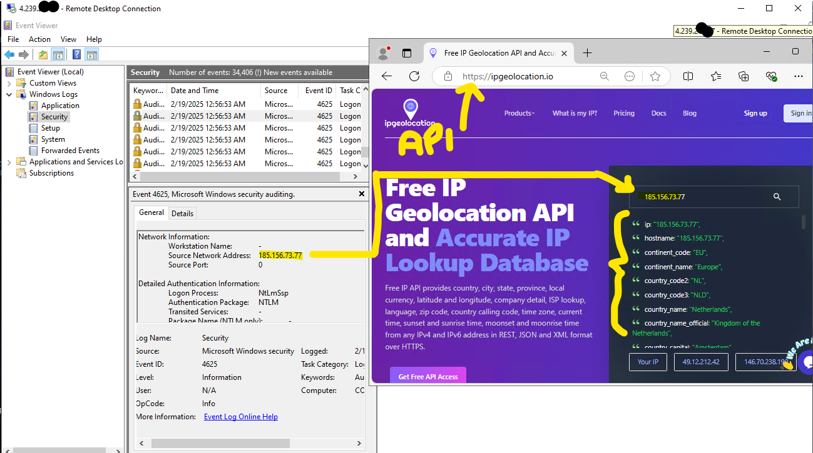
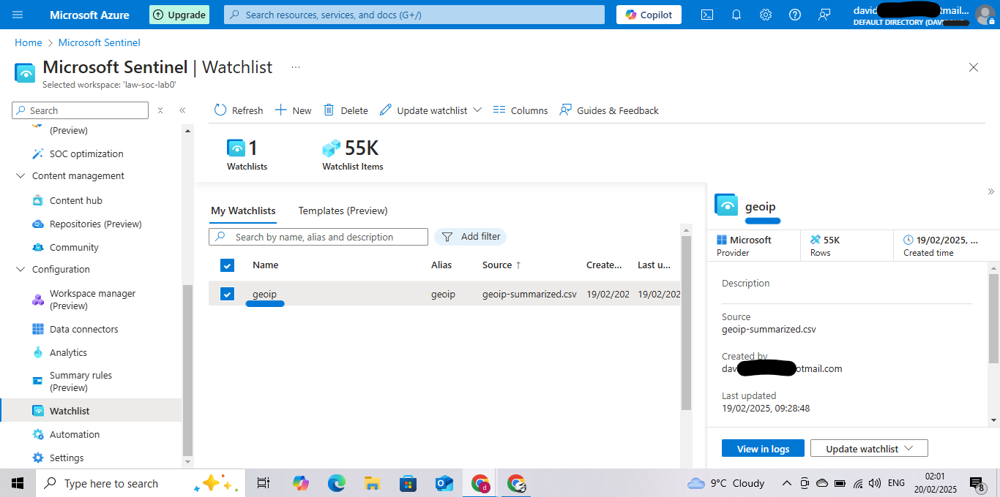
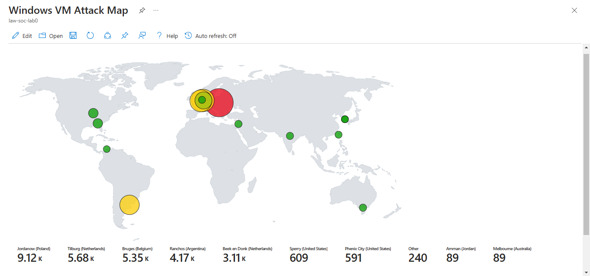

### **📌 Failed RDP Login Analysis with Azure Sentinel**

#### 🔍 **Overview**

This project demonstrates how **Azure Sentinel** can be leveraged to **monitor, detect, and visualise** failed RDP login attempts worldwide.
By utilising **PowerShell scripts, Log Analytics, and Sentinel Workbooks**, we track unauthorised login attempts and map their locations on an interactive world map.

📂 **Key Artifacts in This Repository:**\
✅ **PowerShell script** for extracting Windows Event Log data\
✅ **Azure Sentinel query** to visualise attacks on a map\
✅ **GeoIP Watchlist** for IP-to-Location mapping\
✅ *(Optional)* **Python script** to anonymise real IPs before publishing

---

### **⚙️ Project Breakdown**

#### **1️⃣ Data Collection**

The **PowerShell script** in this repository is responsible for extracting Windows Event Log data related to **failed RDP login attempts** (**Event ID 4625**) and using a **third-party API** to retrieve geographic information about the attackers.

This script was deployed in a **live security demonstration**, where an **Azure Sentinel (SIEM) instance** was configured and connected to a virtual machine acting as a **honeypot**. By doing so, we were able to **observe live brute-force RDP attacks** from all around the world in real-time. The **PowerShell script** then retrieved the attackers' **geolocation details** and plotted them on an **interactive Azure Sentinel map** for further analysis.

📂 **Geolocation API Screenshot:**   


---

#### **2️⃣ Data Ingestion into Azure Sentinel**

- **Azure Log Analytics Workspace** was configured to **ingest custom logs** containing IPs of failed login attempts.
- **A custom GeoIP watchlist** was uploaded to Azure Sentinel to match IP addresses with geographic locations (Country & City).

📂 **Sentinel Dashboard Screenshot:**  


---

#### **3️⃣ Interactive Map Visualization**

Using **Kusto Query Language (KQL)**, we created an **interactive map** in Azure Sentinel, displaying attack locations globally.

📌 **Sentinel Query Used for Mapping Attacks:**

```kql
let GeoIPDB_FULL = _GetWatchlist("geoip");
let WindowsEvents = SecurityEvent;
WindowsEvents 
| where EventID == 4625
| order by TimeGenerated desc
| evaluate ipv4_lookup(GeoIPDB_FULL, IpAddress, network)
| summarize FailureCount = count() by IpAddress, latitude, longitude, cityname, countryname
| project FailureCount, AttackerIp = IpAddress, latitude, longitude, 
         city = cityname, country = countryname,
         friendly_location = strcat(cityname, " (", countryname, ")");
```

📂 **Final Attack Map Visualisation:**   


📌 *The circle size represents the frequency of attacks per location.*

---

### **📜 Files in This Repository**

| File                               | Description                                     |
| ---------------------------------- | ----------------------------------------------- |
| `failed_rdp_logins.csv`            | Raw log file of failed RDP login attempts       |
| `geoip_watchlist.csv`              | Watchlist used for IP-to-Location mapping       |
| `sentinel_query.kql`               | KQL query used to visualise attacks on the map  |
| `sanitise_logs.py` *(Optional)*    | Script to anonymise IPs before sharing results  |
| `Custom_Security_Log_Exporter.ps1` | PowerShell script for extracting Event Log data |

---

### **🔹 Optional: Anonymising IPs Before Sharing**

If you want to share results without exposing real IP addresses, use the **Python script** provided.\
This will replace the last octet of all IP addresses (e.g., `192.168.1.23 → 192.168.1.xxx`).

📂 [sanitise\_logs.py](sanitise_logs.py)

```python
import pandas as pd
import re

file_path = 'failed_rdp_logins.csv'
data = pd.read_csv(file_path)

def sanitize_ip(ip):
    if isinstance(ip, str) and re.match(r'^\d+\.\d+\.\d+\.\d+$', ip):
        return re.sub(r'(\d+\.\d+\.\d+)\.\d+$', r'\1.xxx', ip)
    return ip  

ip_column_name = 'IpAddress'  
if ip_column_name in data.columns:
    data[ip_column_name] = data[ip_column_name].apply(sanitise_ip)

data.to_csv('sanitised_log_file.csv', index=False)
print("Sanitised file saved to sanitised_log_file.csv")
```

---

### **💡 Key Skills Demonstrated**

✅ **Cloud Security & SIEM:** Configuring **Azure Sentinel** for real-time attack detection\
✅ **Threat Intelligence:** Visualising **brute-force RDP attacks** on a **global map**\
✅ **Scripting & Automation:** PowerShell for **log extraction** + Python for **data sanitisation**\
✅ **KQL (Kusto Query Language):** Writing Sentinel queries for **event correlation & mapping**

---

### **🚀 Why This Project?**

This project showcases **real-world security operations** using **Azure Sentinel**—a valuable skill for **SOC Analysts, Security Engineers, and Cloud Security professionals**.\
It demonstrates **SIEM configuration, log analysis, and attack visualisation**, all crucial for **cybersecurity monitoring**.

---

### **📢 Next Steps**

🔹 **Enhance Detection:** Configure Sentinel alerts for repeated failed login attempts\
🔹 **Automate Response:** Integrate with Azure Logic Apps to trigger security actions\
🔹 **Expand Coverage:** Monitor other attack types beyond RDP brute force

---
